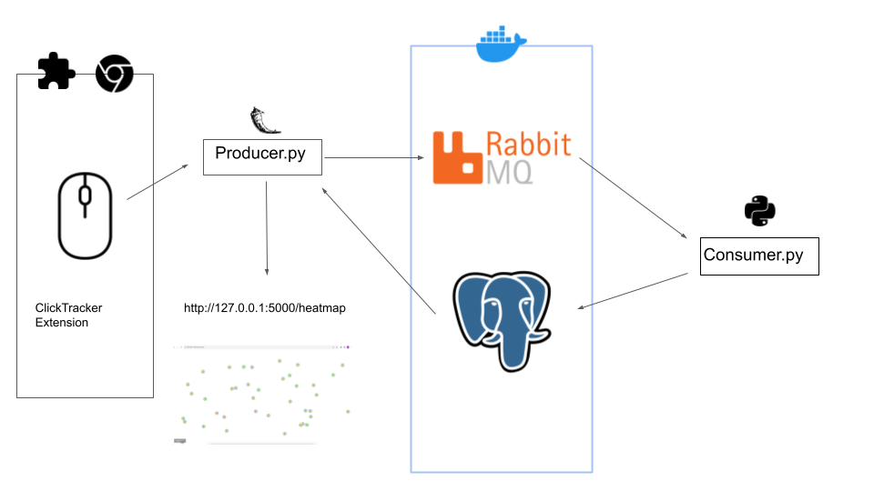

# ClickTracker

A Click tracking data pipeline that stores where your clicks are through a chrome extension using RabbitMQ as a broker. Click locations are stored in a postgres database ran in Docker.

# Why I created this


## Architecture



## How this Works/File Structure

- chromeextension : The unpacked folder being loaded.Contains javascript code to listen to user clicks and sends locations of these clicks to the producer.
- producer : Contains the flask application(producer.py) that listens to post requests from the extension and pushes it onto a queue in RabbitMQ. This also connects to the database and provides a heat map for users to visualize their clicks.
- consumer : Contains the python file that listens for oncoming messages from the queue and relays them into a PostGres Database.
- docker-compose.yaml : Docker compose file. Contains the RabbitMQ broker and


## Run Locally

This project can be easily setup using a docker-compose command. However, since we are using external APIs, you will need to set up API keys 


```bash
  git clone https://link-to-project
```

Go to the project directory

```bash
  cd my-project
```

Install dependencies

```bash
  npm install
```

Start the server

```bash
  npm run start
```


## API Reference

#### Get all items

```http
  GET /api/items
```

| Parameter | Type     | Description                |
| :-------- | :------- | :------------------------- |
| `api_key` | `string` | **Required**. Your API key |

#### Get item

```http
  GET /api/items/${id}
```

| Parameter | Type     | Description                       |
| :-------- | :------- | :-------------------------------- |
| `id`      | `string` | **Required**. Id of item to fetch |

#### add(num1, num2)

Takes two numbers and returns the sum.

